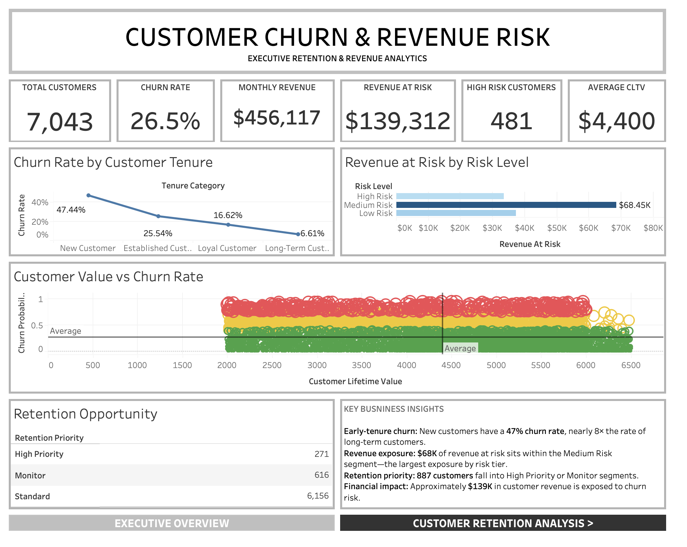
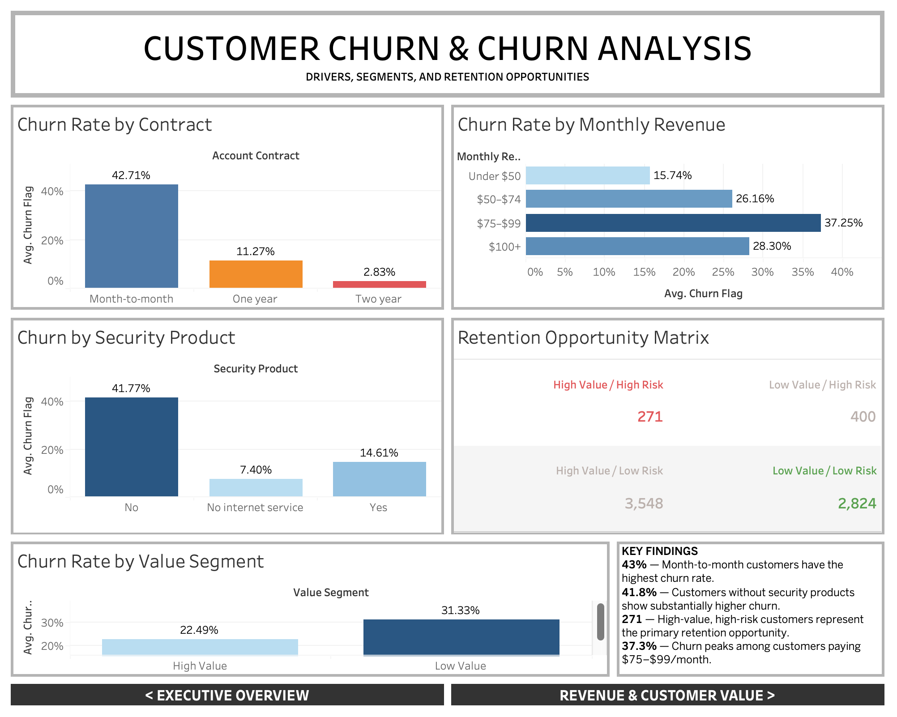
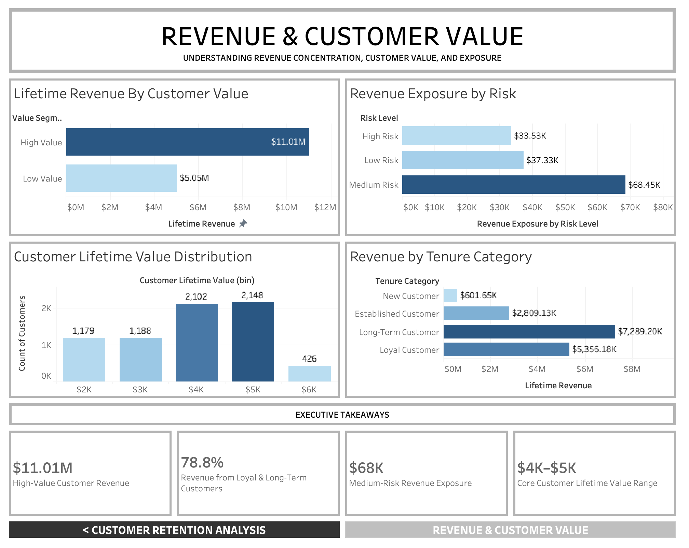

# Customer Churn & Revenue Analytics

## Dashboard Preview

## Business Problem

Customer churn creates significant financial risk for organizations by reducing recurring revenue, increasing customer acquisition costs, and weakening long-term customer value.

The challenge is to identify the customer segments most likely to churn, understand the behavioral and financial factors associated with churn, and quantify the potential revenue exposure associated with at-risk customers.

## Objective

Develop a customer churn and revenue analytics platform using Python, SQL, machine learning, and Tableau to analyze customer behavior, predict churn risk, evaluate customer lifetime value, quantify revenue at risk, and identify actionable retention opportunities.

## Assessment Scope

The project uses the IBM Telco Customer Churn dataset to analyze approximately 7,043 customers and identify patterns associated with customer churn and revenue exposure.

The assessment covers:

- Data cleaning and preparation
- Exploratory data analysis
- SQL-based data analysis
- Customer segmentation
- Churn prediction
- Customer lifetime value analysis
- Revenue risk analysis
- Retention opportunity analysis
- Tableau dashboard development

## Skills Demonstrated

# Coding Languages

- Python
- SQL

# Libraries

- Pandas
- NumPy
- Scikit-learn
- SHAP
- Matplotlib
- Seaborn

# Database

- SQLite
- SQL data analysis
- Data transformation
- Relational data analysis

# Business Intelligence

- Tableau
- Dashboard development
- KPI development
- Data visualization
- Churn analysis
- Revenue risk analysis
- Customer segmentation
- Business insights

# Development Tools

- Git
- GitHub
- Visual Studio Code
- Python Virtual Environment

## Skills Demonstrated

- Data Cleaning & Preparation
- Exploratory Data Analysis
- SQL Analytics
- Customer Segmentation
- Churn Prediction
- Customer Lifetime Value Analysis
- Revenue Risk Analytics
- Retention Analysis
- Risk Analytics
- SHAP Explainable AI
- Data Visualization
- Tableau Dashboard Development
- Business Intelligence
- Data Storytelling

## Dashboard Highlights

- Executive customer and revenue KPIs
- Customer churn analysis
- Churn rate by contract type
- Churn rate by monthly revenue
- Churn rate by security product
- Customer lifetime value analysis
- Revenue exposure by risk level
- Customer retention opportunity matrix
- High-value and high-risk customer identification
- Revenue analysis by customer tenure
- Retention priority segmentation
- Interactive Tableau visualizations
- Executive business insights

## Key Findings

- The dataset contains **7,043 customers** with an overall churn rate of approximately **26.5%**.
- Customers on **month-to-month contracts have a 42.71% churn rate**, substantially higher than customers on one-year contracts at **11.27%** and two-year contracts at **2.83%**.
- Churn is highest among customers with monthly revenue between **$75–$99**, where the churn rate reaches **37.25%**.
- Customers without security products have a **41.77% churn rate**, compared with **14.61%** among customers with security products.
- New customers have a **47.44% churn rate**, compared with only **6.61%** among long-term customers, highlighting significant early-tenure retention risk.
- Low-value customers have a **31.33% churn rate**, compared with **22.49%** among high-value customers.
- Approximately **$139K in customer revenue is exposed to churn risk**, with the largest exposure concentrated in the **Medium Risk** segment at approximately **$68K**.
- The retention opportunity matrix identifies **271 high-value, high-risk customers** as the highest-priority retention segment.
- A total of **887 customers** fall into the High Priority or Monitor retention segments.
- High-value customers represent approximately **$11.01M in lifetime revenue**.
- Loyal and long-term customers account for approximately **78.8% of analyzed lifetime revenue**, demonstrating the financial importance of long-term customer retention.
- Customer lifetime value is concentrated primarily in the **$4K–$5K range**, with 2,102 customers in the $4K range and 2,148 customers in the $5K range.
- Tableau was used to translate customer-level analytics and predictive risk outputs into interactive business intelligence dashboards focused on churn, customer value, revenue exposure, and retention opportunities.